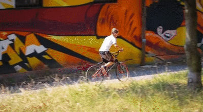
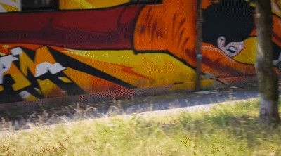
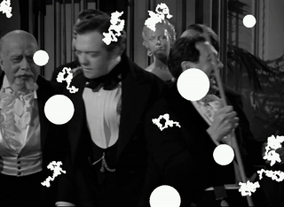
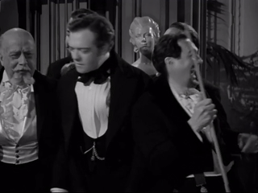

# ProPainter Nodes for ComfyUI

[ComfyUI](https://github.com/comfyanonymous/ComfyUI) implementation of [ProPainter](https://github.com/sczhou/ProPainter) models for video inpainting   . The ProPainter models enable advanced video frame editing by leveraging deep learning techniques for seamless inpainting and outpainting tasks.

## Features

#### 👨🏻‍🎨 Object Removal
<table>
<tr>
   <td> 
      
   </td>
   <td> 
      
   </td>
</tr>
</table>

#### 🎨 Video Completion
<table>
<tr>
   <td> 
      
   </td>
   <td> 
      
   </td>
</tr>
</table>

## Installation
### ComfyUI Manager:
You can use [ComfyUI Manager](https://github.com/ltdrdata/ComfyUI-Manager) to install the nodes:
1. Search for `ComfyUI ProPainter Nodes` and author `daniabib`. 

### Manual Installation:
1. Clone this repository to `ComfyUI/custom_nodes`:
    ```bash
    git clone https://github.com/yourusername/ComfyUI-ProPainter-Nodes.git
    ```

2. Install the required dependencies:
    ```bash
    pip install -r requirements.txt
    ```

Models will be automatically downloaded to the `weights` folder.

## Examples
**Basic Inpainting Workflow**


## Nodes Reference

### ProPainter Inpainting

The ProPainter Inpainting node performs inpainting on video frames, filling in missing regions based on the surrounding content.

#### Input Parameters:
- `image`: The video frames to be inpainted.
- `mask`: The mask indicating the regions to be inpainted. Mask must have same size of video frames.
- `width`: Width of the output images. (default: 640).
- `height`: Height of the output images. (default: 360).
- `mask_dilates`: Dilation size for the mask (default: 5).
- `flow_mask_dilates`: Dilation size for the flow mask (default: 8).
- `ref_stride`: Stride for reference frames (default: 10).
- `neighbor_length`: Length of the neighborhood for inpainting (default: 10).
- `subvideo_length`: Length of subvideos for processing (default: 80).
- `raft_iter`): Number of iterations for RAFT model (default: 20).
- `fp16`: Enable or disable FP16 precision (default: "enable").

#### Output:
- `IMAGE`: The inpainted video frames.
- `FLOW_MASK`: The flow mask used during inpainting.
- `MASK_DILATE`: The dilated mask used during inpainting.

### ProPainter Outpainting

The ProPainter Outpainting node extends the boundaries of video frames, generating new content beyond the original edges.

#### Input Parameters:
- `image`: The video frames to be outpainted.
- `width`: Width of the video frames (default: 640).
- `height`: Height of the video frames (default: 360).
- `width_scale`: Scale factor for width expansion (default: 1.2).
- `height_scale`: Scale factor for height expansion (default: 1.0).
- `mask_dilates`: Dilation size for the mask (default: 5).
- `flow_mask_dilates`: Dilation size for the flow mask (default: 8).
- `ref_stride`: Stride for reference frames (default: 10).
- `neighbor_length`: Length of the neighborhood for outpainting (default: 10).
- `subvideo_length`: Length of subvideos for processing (default: 80).
- `raft_iter`: Number of iterations for RAFT model (default: 20).
- `fp16`: Enable or disable FP16 precision (default: "disable").

#### Output:
- `IMAGE`: The outpainted video frames.
- `OUTPAINT_MASK`: The mask used during outpainting.
- `output_width`: The width of the outpainted frames.
- `output_height`: The height of the outpainted frames.

## Others suggested nodes
I suggest using [VideoHelperSuite](https://github.com/Kosinkadink/ComfyUI-VideoHelperSuite) for loading and saving the video frames.

## License
The ProPainter models and code are licensed under [NTU S-Lab License 1.0](https://github.com/sczhou/ProPainter/blob/main/LICENSE).